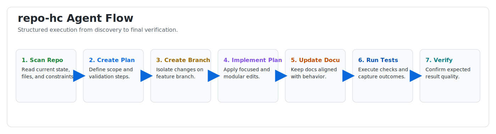

# repo-hc

<p align="center">
  <a href="./README.md"></a>
  <a href="https://www.npmjs.com/package/repo-hc"></a>
  <a href="https://www.npmjs.com/package/repo-hc"></a>
  <a href="https://www.npmjs.com/package/repo-hc"></a>
  <a href="https://github.com/iptoux/repo-hc/stargazers"></a>
  <a href="https://openai.com/"></a>
  <a href="./docs/README.md"></a>
  <a href="./SECURITY.md"></a>
  <a href="./LICENSE.txt"></a>
</p>

<h3 align="center">
  <code>repo-hc</code> is a developer npm package for automated GitHub housekeeping.<br/>
  It provides AI-agent guidance and workflow contracts to keep repositories clean, secure, and well documented.
</h3>

> [!IMPORTANT]
> `repo-hc` is published on npm. This repository remains the source of truth for architecture, rules, and documentation.

## Table of Contents

- [Vision](#vision)
- [AI Agent Workflow System](#ai-agent-workflow-system)
- [Installation](#installation)
- [Bootstrap Behavior](#bootstrap-behavior)
- [What The Package Will Cover](#what-the-package-will-cover)
- [Documentation System](#documentation-system)
- [Repository Layout](#repository-layout)
- [Contributing](#contributing)
- [License](#license)

## Vision

`repo-hc` is designed to standardize how an AI agent maintains a repository by enforcing repeatable housekeeping practices:

- plan-first execution
- branch discipline
- security-aware changes
- synchronized documentation
- explicit auditability of AI-assisted work

Initial optimization target: **OpenAI Codex**.

## AI Agent Workflow System

AI-assisted work in this repository is guided by [AGENTS.md](./AGENTS.md) and the local [`.agents/`](./.agents/README.md) knowledge base:




- [AGENTS.md](./AGENTS.md): baseline collaboration, architecture, security, and documentation rules
- [`.agents/rules/`](./.agents/rules/): user-defined operational rules
- [`.agents/skills/`](./.agents/skills/): reusable `SKILL.md` playbooks
- [`.agents/learnings/`](./.agents/learnings/): implementation learnings and decisions
- [`.agents/prompts/`](./.agents/prompts/): sanitized source prompts for traceability
- [`.agents/plans/`](./.agents/plans/): scoped feature implementation plans

## Installation

```bash
npm view repo-hc version
pnpm add repo-hc
pnpm exec repo-hc init
```

Install directly from npm:

- package name: `repo-hc`

> [!TIP]
> Start every AI-assisted task with [AGENTS.md](./AGENTS.md), then continue with [`.agents/README.md`](./.agents/README.md), then [docs/README.md](./docs/README.md).
> The effective behavior rules are user-defined in [`/.agents/rules`](./.agents/rules/).

## Bootstrap Behavior

Run `repo-hc init` after installation to bootstrap these assets into the consumer project root:

- `.agents/`
- `docs/`
- `AGENTS.md` (canonical)

For `.agents/`, repository-internal non-example files are excluded from transfer in:

- `.agents/rules/`
- `.agents/learnings/`
- `.agents/plans/`
- `.agents/prompts/`

Only each folder's `examples/` content is copied for those areas.

When `repo-hc init` runs interactively, it also asks whether common agent files should be hidden in VS Code Explorer.  
If confirmed, it creates or updates `.vscode/settings.json` with `files.exclude` entries for:

- `.agents`
- `AGENTS.md`

Existing files are preserved by default (non-destructive copy). To run or re-run:

```bash
pnpm exec repo-hc init
```

To overwrite existing files intentionally:

```bash
pnpm exec repo-hc init --force
```

## What The Package Will Cover

- repository hygiene workflows for AI agents
- change planning and branch policies
- documentation synchronization rules
- security and secret-handling safeguards
- reusable prompts, learnings, and skills integration

## Documentation System

Project documentation is centralized in [`docs/`](./docs/) and organized by feature, audience, and architecture diagrams:

- [`docs/README.md`](./docs/README.md): docs index and reading order
- [`docs/project/`](./docs/project/): global standards and rules
- [`docs/workflow/`](./docs/workflow/): contributor workflow guides
- [`docs/housekeeping/`](./docs/housekeeping/): package-specific developer and user docs
- [`docs/mermaid/`](./docs/mermaid/): architecture and workflow diagrams

## Repository Layout

- [AGENTS.md](./AGENTS.md): baseline guidance for AI-assisted implementation
- [`.agents/`](./.agents/README.md): internal rules, prompts, learnings, plans, and skills
- [docs/](./docs/README.md): public project documentation and Mermaid diagrams
- [CONTRIBUTING.md](./CONTRIBUTING.md): contributor workflow
- [SECURITY.md](./SECURITY.md): vulnerability reporting and security baseline

## Contributing

Please follow the process in [CONTRIBUTING.md](./CONTRIBUTING.md).

Short version:

1. Create a dedicated feature branch.
2. Create a scoped plan in `.agents/plans/` before implementation.
3. Keep documentation in sync with every behavior or workflow change.

## License

Licensed under AGPL-3.0. See [LICENSE.txt](./LICENSE.txt).

