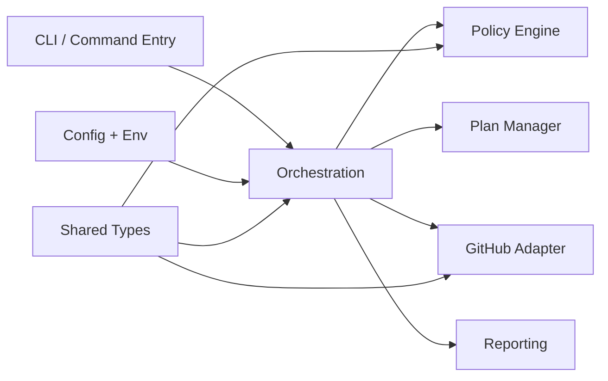
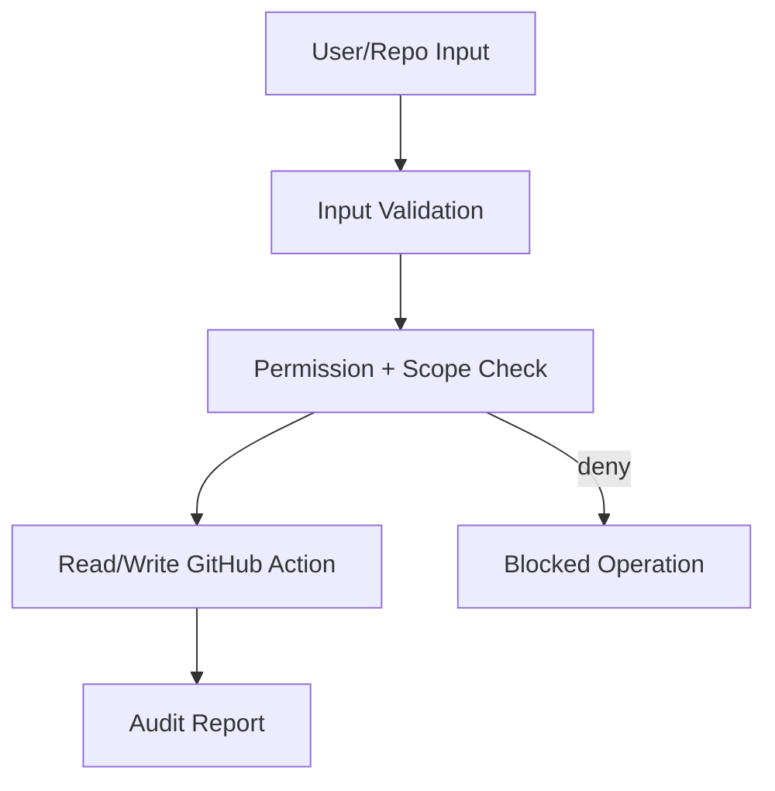
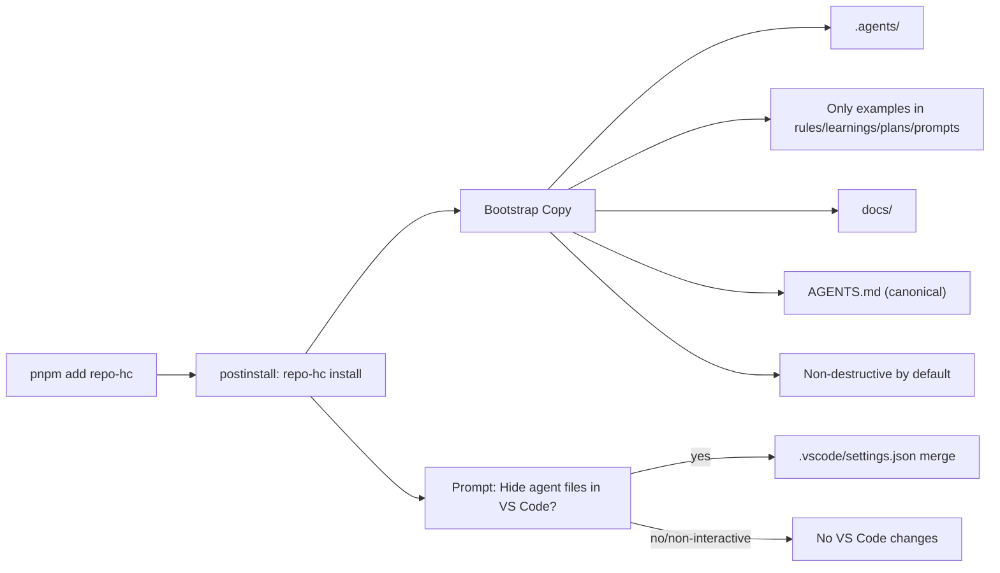

# Housekeeping Package Architecture (Mermaid)

Back to docs:

- [Docs Home](../README.md)
- [Housekeeping Documentation](../housekeeping/README.md)
- [Workflow Documentation](../workflow/README.md)

## Module Boundaries

## Security Control Points

## Install Bootstrap Flow

