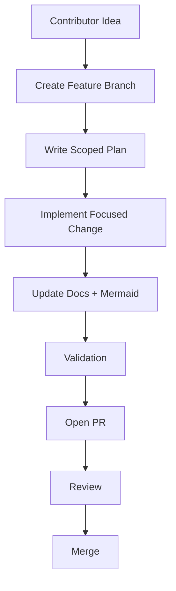
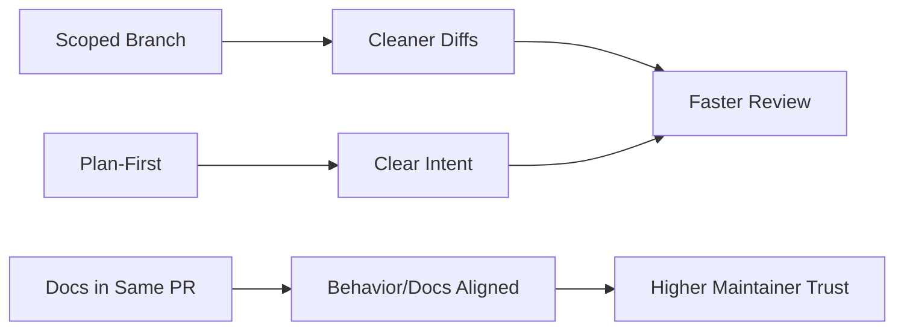

# Workflow Community PR Lifecycle (Mermaid)

Back to docs:

- [Docs Home](../README.md)
- [Workflow Documentation](../workflow/README.md)
- [Project Rules](../project/rules.md)

## Contribution Lifecycle

## Quality Effects

