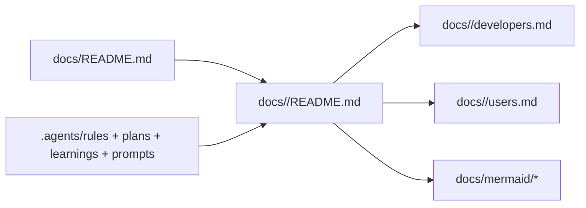
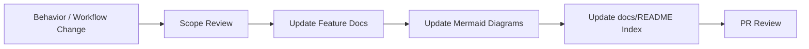

# Workflow Docs System (Mermaid)

Back to docs:

- [Docs Home](../README.md)
- [Workflow Documentation](../workflow/README.md)
- [Housekeeping Documentation](../housekeeping/README.md)

## Self-Contained Documentation Structure

## Documentation Sync Workflow

