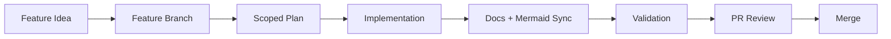

# Workflow Developer Guide

This guide defines the default workflow for maintaining `repo-hc`.

## Why This Workflow Exists

The project is intended for AI-assisted repository housekeeping. To keep changes safe and reviewable, every feature follows a strict process:

- dedicated feature branch
- scoped implementation plan before coding
- focused implementation
- synchronized docs and Mermaid diagrams in the same change

## Core Workflow

1. Create a feature branch.
2. Write a scoped plan in `.agents/plans/`.
3. Implement focused changes.
4. Update `docs/<feature>/` docs.
5. Update `docs/mermaid/` diagrams when architecture or workflow changes.
6. Validate consistency and open PR.

## Documentation Sync Expectations

- keep behavior and docs in one PR
- keep links valid
- keep terminology consistent across `AGENTS.md`, `.agents`, and `docs/`
- avoid stale architecture diagrams

## Developer Checklist

Before opening a PR:

1. branch is feature-scoped and not `main`
2. plan exists and matches implementation
3. feature docs are updated (`README.md`, `developers.md`, `users.md`)
4. Mermaid diagrams match current workflow/architecture
5. security guidance remains accurate

## Related

- [Workflow User Guide](./users.md)
- [Docs System and Sync Flow](../mermaid/workflow-docs-system.md)
- [Community PR Lifecycle](../mermaid/workflow-community-pr-lifecycle.md)
- [Project Rules](../project/rules.md)
