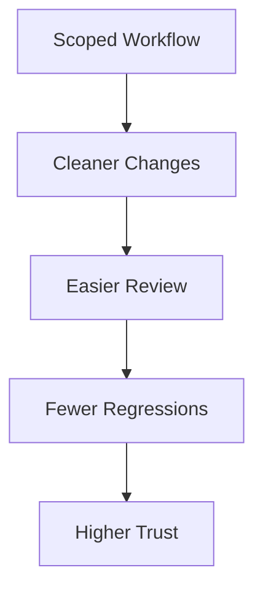

# Workflow User Guide

This guide explains how the repository workflow benefits maintainers and users.

## User Benefits

The branch-plan-doc workflow improves:

- clarity of changes
- predictability of behavior
- security review quality
- trust in AI-assisted updates

## What To Expect In Changes

High-quality changes in this repository should include:

- a scoped feature branch
- a plan file under `.agents/plans/`
- synchronized docs in `docs/`
- updated diagrams when architecture/workflow changes

## Quick Validation Path

1. Check `AGENTS.md` for baseline rules.
2. Open relevant feature docs under `docs/<feature>/`.
3. Verify matching diagrams in `docs/mermaid/`.
4. Confirm docs and implementation were updated together.

## Related

- [Workflow Developer Guide](./developers.md)
- [Docs Home](../README.md)
- [Housekeeping User Guide](../housekeeping/users.md)
